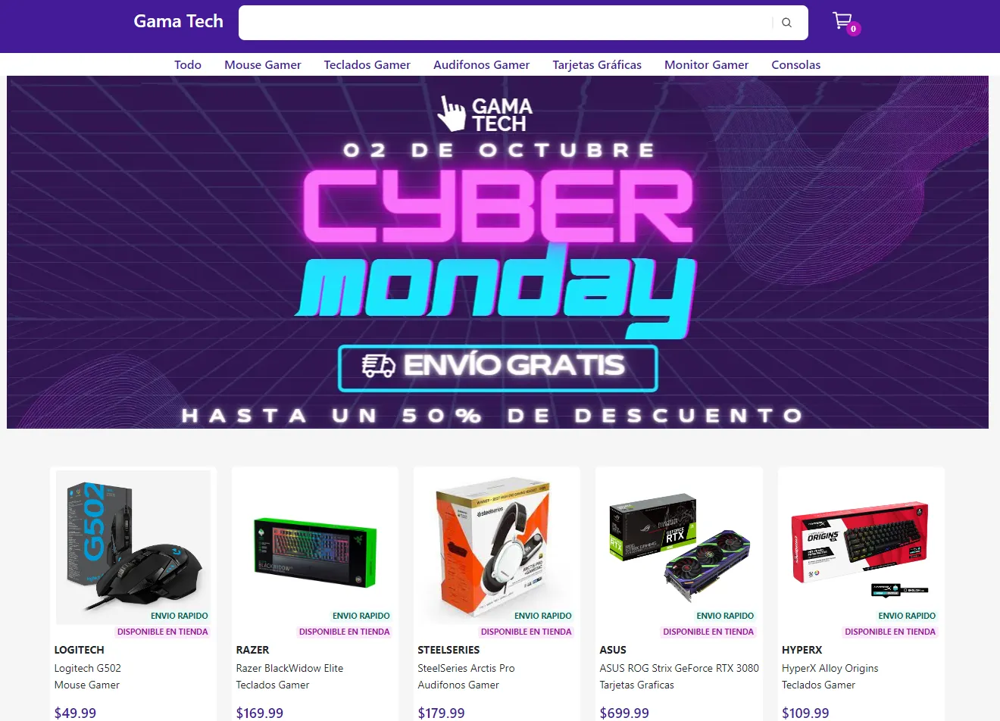
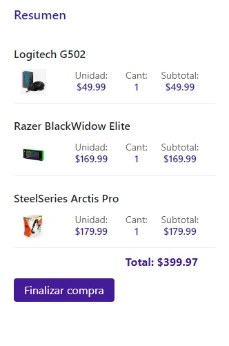

# Gama Tech - Tienda Online

Bienvenido a **Gama Tech**, una tienda (demo) en línea de productos electrónicos para gamers. Este proyecto te permite explorar, buscar y comprar una amplia variedad de productos, desde mouse y teclados gamer hasta tarjetas gráficas y consolas.

## Capturas de Pantalla


[](assets/img/captura-1.webp)
[](assets/img/captura-2.webp)


## Características

- Explora una amplia variedad de productos electrónicos para gamers.
- Filtra productos por categoría.
- Realiza búsquedas de productos.
- Agrega productos al carrito de compras.
- Verifica el carrito, actualiza cantidades y finaliza la compra.
- Interfaz de usuario intuitiva y atractiva.

## Tecnologías Utilizadas

- HTML
- CSS (Bootstrap)
- JavaScript
- Bibliotecas de terceros (Toastify y SweetAlert2)

## Cómo Usar

1. Clona este repositorio en tu máquina local.

```bash
git clone https://github.com/tu-usuario/tu-repositorio.git